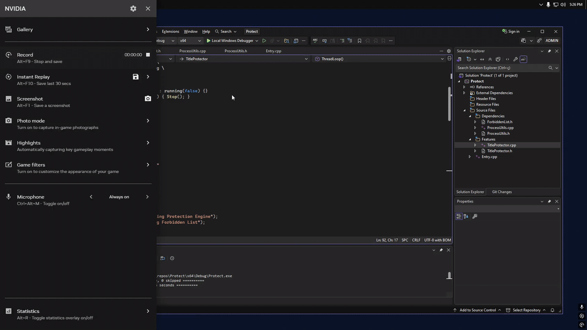

## Visão geral

O Title Protector é uma camada defensiva leve que verifica os títulos das janelas ativas e encerra o aplicativo se um título bloqueado for detectado.

Este não é um método de proteção robusto. Ele se destina apenas a ser uma camada adicional.

---

## Como funciona

- Monitora os títulos das janelas abertas no momento
- Compara-os com uma lista de bloqueios configurável
- Encerra o aplicativo quando encontra uma correspondência  

Exemplo de lista de bloqueios:

```txt
x64dbg
dnSpy
IDA
ILSpy
Process Hacker
Cheat Engine
```

---

## Configuração

A lista de bloqueios é totalmente editável.  
Sem dependências externas.  
Simples e leve por padrão.

---

## Preview

<p align="center">
  
</p>
